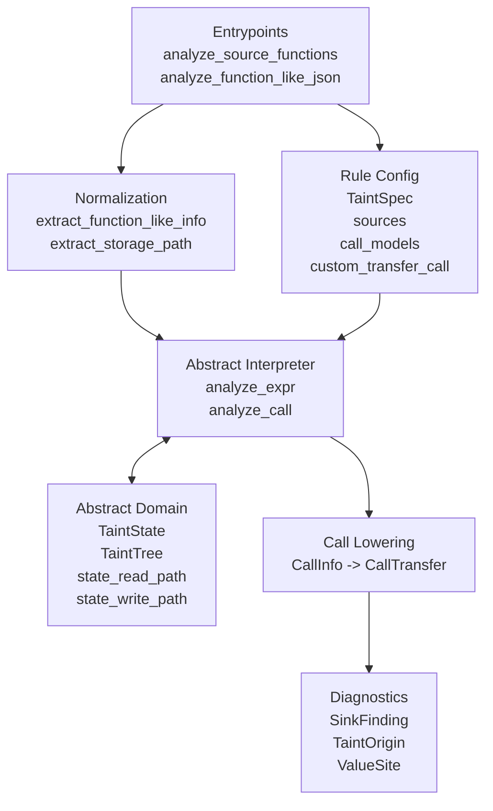

# `taint` Package Architecture

`taint` performs intraprocedural taint analysis over MoonBit AST JSON. It
analyzes one function or method at a time, keeps storage-path precision, and
models most call behaviour with declarative `sources` and `call_models`.

## Overview

Each `TaintSpec` is one taint rule:

- `rule_id` identifies the rule.
- `sources` models entry sources and call-return sources.
- `call_models` models propagation, sanitizers, and sinks.
- `custom_transfer_call` is the escape hatch for cases the DSL cannot express.
- `unknown_call_policy` controls the fallback for unmodeled calls.

Public entrypoints:

- `analyze_function_like_json`
- `analyze_function_like_json_multi`
- `analyze_source_functions`
- `analyze_source_functions_multi`

## Concept Layers

### State Layer

`StoragePath` answers:

> Where, inside the current function, can taint live?

Examples:

- `user`
- `user.profile.email`
- `arr[0]`
- `arr[*]`

This layer is used by:

- `state_read_path`
- `state_write_path`
- `state_kill_path`

### Value Layer

`TaintTree` answers:

> Which parts of the current value are tainted?

It is relative to the value being evaluated, not to a variable name.

### Diagnostic Layer

`ValueSite` answers:

- where a tainted value came from
- which value a sink consumed

It intentionally separates diagnostics from state addressing:

- `ValueSite::Path(path)`
- `ValueSite::CallResult(callee_name, loc)`
- `ValueSite::Expr(loc, summary)`
- `ValueSite::Synthetic(label)`

`TaintOrigin.site` and `SinkFinding.sink_site` both use `ValueSite`.

### Rule Layer

Most rules should stay in the declarative layer:

- `SourceModel::EntryPath`
- `SourceModel::CallReturn`
- `CallModel`
- `CallEffect`

The common call effects are:

- fresh source on return
- argument/receiver to return propagation
- argument/receiver kill
- sink reporting on argument/receiver

## Call Modeling

Call evaluation stays in the existing abstract interpreter. What changed is the
configuration contract.

When the engine sees a call, it builds `CallInfo` and applies models in this
order:

1. `custom_transfer_call`
2. declarative lowering from `sources` and `call_models`
3. `unknown_call_policy`

This preserves the old escape hatch while making common rules much easier to
write.

## Main Flow

At a high level:

1. normalize a top-level function-like AST node
2. seed entry taint from `SourceModel::EntryPath`
3. evaluate expressions with the abstract interpreter
4. lower declarative/custom call behaviour to `CallTransfer`
5. stamp findings with `rule_id`
6. return deduplicated `AnalysisResult`

## Important Semantics

- Reads are more permissive than writes: `arr[i]` can observe both `arr[*]` and
  precise buckets such as `arr[0]`.
- Writes and kills are exact: writing `x.a` does not delete `x.b`.
- Joins are union-based: if any path can taint a location, the merged state
  keeps that possibility.
- Nested function bodies remain analysis boundaries.
- The engine is still intraprocedural. No call graph or cross-function summary
  cache is introduced here.
